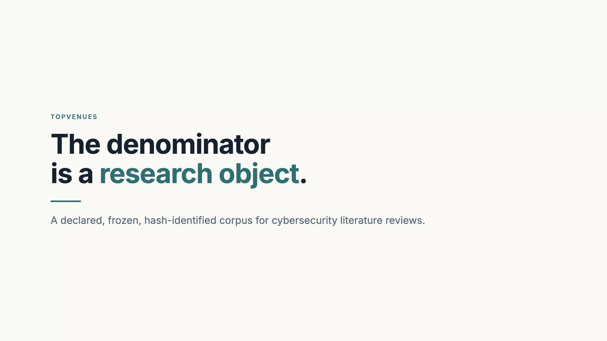

# TopVenues

TopVenues is an open-source, local-first tool for constructing and inspecting a declared corpus for cybersecurity literature reviews. The current researcher-facing release is pinned to the immutable `security-20-v4` profile.

The accepted SBSeg-SF paper remains bound to the immutable [`sbseg2026-sf-submission-r1`](https://github.com/sidneibarbieri/topvenues-tool/releases/tag/sbseg2026-sf-submission-r1) release and its `security-20` snapshot. It is preserved unchanged; do not use current counts to verify claims in that paper.

## Authors

- Sidnei Barbieri — `sidneibarbieri@gmail.com`
- Ágney Lopes Roth Ferraz — `agneyroth@gmail.com`
- Lourenço Alves Pereira Júnior — `lourenco.junior@gp.ita.br`


| Property | Value |
| --- | --- |
| Tool release | `v1.9.0` |
| Snapshot source release | `v1.2.1` |
| Scope | 20 declared security and security-relevant venues |
| Records | 14,859 corpus records |
| Abstract-enriched records | 13,987 (94.1%) |
| BibTeX entries | 14,859 |
| Snapshot SHA-256 | `bcb762c1c9b1f8ce6f075a8c1a23d68310caec853b0cc8ce3f42931e43c370c5` |

The successor enforces the declared 2019–2026 window, inherits exact-resource deduplication, and repairs ten titles truncated at inline DBLP markup. Four same-metadata pairs remain separate because their publisher resources remain distinct; metadata similarity alone is not identity evidence. The versioned decision records are in `data/adjudication/`. Records without abstracts remain available for metadata and citation workflows; abstract-dependent retrieval must treat them as missing data, not negative evidence. The declared scope, per-venue coverage, identity policy, and exact snapshot identity are in `profiles/security-20-v4/config.yaml` and `data/profiles/security-20-v4/manifest.json`.

## Reviewer quick start

### Linux and macOS

Requires Python 3.11–3.14, Git, and Bash.

```bash
git clone --depth 1 --branch v1.9.0 https://github.com/sidneibarbieri/topvenues-tool.git
cd topvenues-tool
bash reproduce.sh --profile security-20-v4
```

The command installs the CLI and web dependencies, verifies the snapshot manifest, materializes a disposable SQLite database, runs the regression suite, starts and health-checks the Streamlit interface, exercises search, and writes a BibTeX sample. It needs no API key, institutional access, publisher credential, or GPU. After dependencies are installed, validation is offline.

### Native Windows

Requires Python 3.11–3.14 with the Python Launcher (`py`), Git, and
PowerShell. Use the native PowerShell workflow rather than editing the Unix
script or mixing Git Bash and PowerShell environments:

```powershell
git clone --depth 1 --branch v1.9.0 https://github.com/sidneibarbieri/topvenues-tool.git
cd topvenues-tool
powershell -ExecutionPolicy Bypass -File .\reproduce.ps1 -Profile security-20-v4
```

The script creates `.venv` and installs the hash-locked cross-platform
`requirements-frozen.txt` itself. If a prior
attempt created `.venv` with Python 3.10 or older, remove only that directory
before rerunning: `Remove-Item -Recurse -Force .venv`.

Do not start a second reproduction while one is running. The verification
script refreshes a disposable local SQLite copy; materialization is serialized
and a locked database produces an actionable wait-and-retry error.

For a concise evidence map, read [REVIEWER_GUIDE.md](REVIEWER_GUIDE.md). For the full artifact boundary, read [ARTIFACT_README.md](ARTIFACT_README.md).

## Use the local interface

```bash
source .venv/bin/activate
python -m streamlit run web/app.py
```

On Windows PowerShell, activate with `.\.venv\Scripts\Activate.ps1` before
running the same `python -m streamlit run web/app.py` command.

The interface exposes coverage inspection, substring and BM25-ranked search,
topic trends, Researcher Radar, and exports. Search and author analytics offer
an explicit Security top-4 scope: ACM CCS, IEEE S&P, USENIX
Security, and NDSS. Aggregates are traceable to supporting records. Researcher
Radar adds exact-identity trajectories, direct coauthorship, recent publication-
rate change, portable watchlists, and an explicitly unverified arXiv name-search
handoff. These are corpus observations, not measurements of citations, quality,
seniority, authority, or future impact. See
[docs/RESEARCH_WORKFLOWS.md](docs/RESEARCH_WORKFLOWS.md) before using a tier
restriction or monitoring signal. The local interface runs at
`http://localhost:8501`.

## Interface walkthrough

[](docs/assets/topvenues-abstract-search.pdf)

This capture runs BM25 search for `LLM security` within the Security top-4 and
returns 78 inspectable records. The linked
[high-resolution PDF](docs/assets/topvenues-abstract-search.pdf) preserves the
capture for close inspection. Additional current-release captures show the
[corpus overview](docs/assets/screenshots/overview.png),
[topic trend](docs/assets/screenshots/insights-llm-top4.png),
[researcher trajectory and collaboration evidence](docs/assets/screenshots/researcher-radar-llm-top4.png),
and [manual audit evidence](docs/assets/screenshots/evidence.png).

## Demonstration

[](docs/assets/demos/topvenues-demo-v1.5.9.mp4)

Seven minutes and forty-nine seconds, in 1920x1080, recorded against this
release. It follows one path end to end: the problem a fixed denominator
solves, installation and offline verification, an ordinary search with its
exports, then the four passes of the Insights page, the audit evidence, and the
immutability boundary.

Narration is US English; captions ship in Brazilian Portuguese, the default
stream, and English. Sidecar SRT files, the timed narration source, and the
shot plan are in [docs/demo/](docs/demo/README.md).

## Command-line workflows

```bash
# Inspect corpus state and coverage
python -m src.cli --profile security-20-v4 stats

# Search records that mention a term
python -m src.cli --profile security-20-v4 search --abstract "intrusion detection"

# Restrict a review query to the Security top-4
python -m src.cli --profile security-20-v4 search --rank "LLM security" \
  --tier-scope "Security top-4" --limit 20

# Build a topic-specific author shortlist from Tier 1 evidence
python -m src.cli --profile security-20-v4 authors --topic "fuzzing" \
  --tier-scope "Security top-4"

# Rank records by multi-token FTS5/BM25 relevance
python -m src.cli --profile security-20-v4 search --rank "memory corruption mitigations" --limit 20

# Export a review-ready subset
python -m src.cli --profile security-20-v4 export --format bibtex --tech "fuzzing" \
  --tier-scope "Security top-4" -o fuzzing-tier1.bib

# Build the Hugging Face Parquet export from the immutable profile
python -m src.cli --profile security-20-v4 export-hf --release-tag v1.9.0

# Create and later evaluate a portable research watch
python scripts/evaluate_watchlist.py topvenues-watchlist.json --profile security-20-v4

# Repeat or extend the deterministic manual-audit protocol
python scripts/manual_abstract_audit.py --profile security-20-v4 --sample-size 200
```

Substring and ranked search answer different questions: substring search finds records that mention text, whereas ranked search orders title, abstract, and author matches by BM25. Multi-word ranked queries use token semantics.

## Scope and extension

Venue names and policies are explicit because they define the scientific denominator. Adding a venue requires a deliberate configuration change, normalization mapping, coverage check, a new immutable profile snapshot, and a new release tag. It is not a routine refresh of this object.

Live `download`, `consolidate`, `extract`, and `bibtex` commands are maintenance operations. They may use changing external services; they do not alter the committed release snapshot. Unexpected collection errors surface to the caller rather than being silently converted into successful enrichment.

The released profile disables live refresh controls in the web interface. The **Dataset lifecycle** page describes the boundary; the controlled successor-profile procedure is in [docs/PROFILE_REFRESH.md](docs/PROFILE_REFRESH.md). The SBSeg bench and seven-minute presentation walkthrough is in [docs/SBSEG_2026_DEMO_SCRIPT.md](docs/SBSEG_2026_DEMO_SCRIPT.md).

The companion full paper's 200-record audit and live baseline comparison are documented in [docs/COMPANION_FULL_PAPER_EVALUATION.md](docs/COMPANION_FULL_PAPER_EVALUATION.md) and remain bound to that paper's snapshot. The current corpus has a separate completed 200-record human audit: 169 records satisfied all three criteria (84.5%; 95% Wilson interval 78.8%–88.9%). The v3 labels transfer to v4 because every paper ID and abstract byte is unchanged; the machine-readable transfer check is in `evaluation/security-20-v4/audit_transfer.json`. See [docs/MANUAL_ABSTRACT_AUDIT.md](docs/MANUAL_ABSTRACT_AUDIT.md).

## Distribution boundary

The package bundles the snapshots for `security-20`, `security-20-v3` and
`security-20-v4`. `security-20` is among them because the published
tools-track paper prints `bash reproduce.sh --profile security-20` as its
reviewer's command, and that command runs against a bare clone with no fetch
step.

`security-20-v2` keeps its manifest visible while its unchanged binary stays in
the release tag where it was published. Fetch it explicitly with
`python scripts/fetch_archived_profile.py --profile security-20-v2`, so a
reviewer downloads a superseded corpus only when they actually want to compare
against it.

## Hugging Face export

The public dataset is at [sidneibarbieri/topvenues](https://huggingface.co/datasets/sidneibarbieri/topvenues). The dataset card records the selected profile, source tag, and snapshot SHA-256.

## License and provenance

TopVenues code is released under the MIT license. DBLP bibliographic metadata and BibTeX follow DBLP's CC0 terms. Original abstract text remains subject to its source terms; the tool records provenance and does not claim ownership of third-party abstracts.
