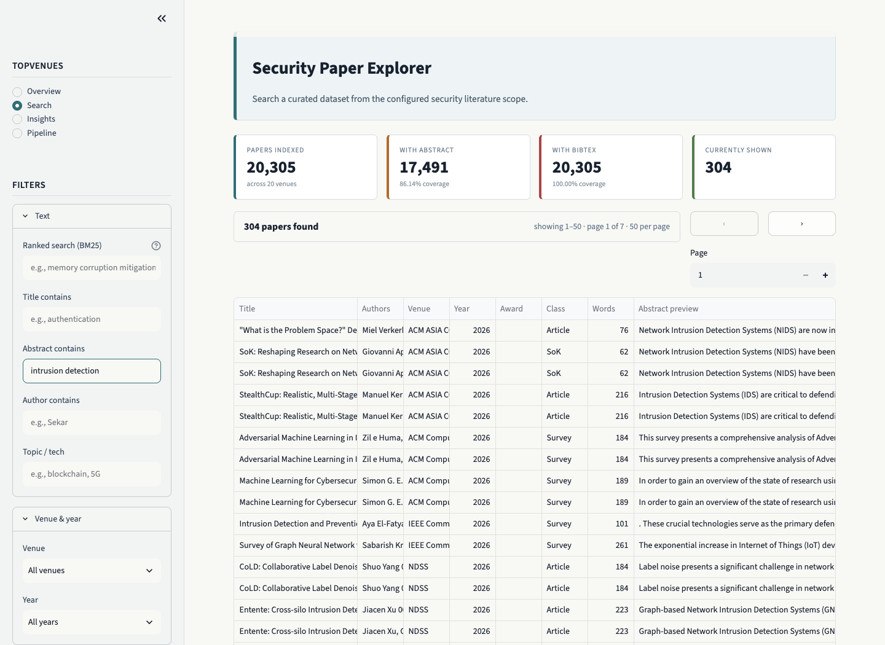

# TopVenues

TopVenues is an open-source, local-first tool for constructing and inspecting a declared corpus for cybersecurity literature reviews. This public release is pinned to the immutable `security-20` profile.

## Authors

- Sidnei Barbieri — `sidneibarbieri@gmail.com`
- Ágney Lopes Roth Ferraz — `agneyroth@gmail.com`
- Lourenço Alves Pereira Júnior — `lourenco.junior@gp.ita.br`


| Property | Value |
| --- | --- |
| Release | [`sbseg2026-sf-submission-r1`](https://github.com/sidneibarbieri/topvenues-tool/releases/tag/sbseg2026-sf-submission-r1) |
| Scope | 20 declared security and security-relevant venues |
| Records | 20,305 |
| Abstract-enriched records | 17,491 (86.1%) |
| BibTeX entries | 20,305 |
| Snapshot SHA-256 | `5a35bd6e3ec6845a0fde4cc3d6aa05b1db04e511cb39e783eeaee2cea7493b08` |

The release keeps records with missing abstracts for metadata and citation workflows. Abstract-dependent retrieval must treat those records as missing data rather than as negative evidence. The declared scope, per-venue coverage, and exact snapshot identity are in `profiles/security-20/config.yaml` and `data/profiles/security-20/manifest.json`.

## Reviewer quick start

```bash
git clone --branch sbseg2026-sf-submission-r1 https://github.com/sidneibarbieri/topvenues-tool.git
cd topvenues-tool
bash reproduce.sh
```

The command installs declared dependencies, verifies the snapshot manifest, materializes a disposable SQLite database, runs 240 tests, builds FTS5, exercises search, and writes a BibTeX sample. It needs no API key, institutional access, publisher credential, or GPU. After dependencies are installed, validation is offline.

### Native Windows

`reproduce.sh` is a Bash/Unix script. On Windows, install Python 3.11 or 3.12
with the Python Launcher (`py`), then use PowerShell rather than editing that
script or mixing Git Bash and PowerShell environments:

```powershell
powershell -ExecutionPolicy Bypass -File .\reproduce.ps1
```

The script creates `.venv` and installs `requirements.txt` itself. If a prior
attempt created `.venv` with Python 3.10 or older, remove only that directory
before rerunning: `Remove-Item -Recurse -Force .venv`.

Do not start a second reproduction while one is running. The verification
script refreshes a disposable local SQLite copy; materialization is serialized
and a locked database produces an actionable wait-and-retry error.

For a concise evidence map, read [REVIEWER_GUIDE.md](REVIEWER_GUIDE.md). For the full artifact boundary, read [ARTIFACT_README.md](ARTIFACT_README.md).

## Use the local interface

```bash
source .venv/bin/activate
python -m streamlit run web/app.py
```

The interface exposes coverage inspection, substring and BM25-ranked search, author and trend exploration, and exports. It runs against the local snapshot at `http://localhost:8501`.

## Inspect abstract evidence

[](docs/assets/topvenues-abstract-search.pdf)

This capture applies the interface's **Abstract contains** filter to `intrusion detection` in `security-20`. Every displayed row has an abstract preview. The linked [high-resolution PDF](docs/assets/topvenues-abstract-search.pdf) preserves the capture for close inspection.

## Command-line workflows

```bash
# Inspect corpus state and coverage
python -m src.cli --profile security-20 stats

# Search records that mention a term
python -m src.cli --profile security-20 search --abstract "intrusion detection"

# Rank records by multi-token FTS5/BM25 relevance
python -m src.cli --profile security-20 search --rank "memory corruption mitigations" --limit 20

# Export a review-ready subset
python -m src.cli --profile security-20 export --format bibtex --tech "fuzzing" -o fuzzing.bib

# Build the Hugging Face Parquet export from the immutable profile
python -m src.cli --profile security-20 export-hf --release-tag sbseg2026-sf-submission-r1
```

Substring and ranked search answer different questions: substring search finds records that mention text, whereas ranked search orders title, abstract, and author matches by BM25. Multi-word ranked queries use token semantics.

## Scope and extension

Venue names and policies are explicit because they define the scientific denominator. Adding a venue requires a deliberate configuration change, normalization mapping, coverage check, a new immutable profile snapshot, and a new release tag. It is not a routine refresh of this object.

Live `download`, `consolidate`, `extract`, and `bibtex` commands are maintenance operations. They may use changing external services; they do not alter the committed release snapshot. Unexpected collection errors surface to the caller rather than being silently converted into successful enrichment.

## Hugging Face export

The public dataset is at [sidneibarbieri/topvenues](https://huggingface.co/datasets/sidneibarbieri/topvenues). It is a two-shard Parquet export of `security-20`; its dataset card records the profile, source tag, and snapshot SHA-256.

## License and provenance

TopVenues code is released under the MIT license. DBLP bibliographic metadata and BibTeX follow DBLP's CC0 terms. Original abstract text remains subject to its source terms; the tool records provenance and does not claim ownership of third-party abstracts.
