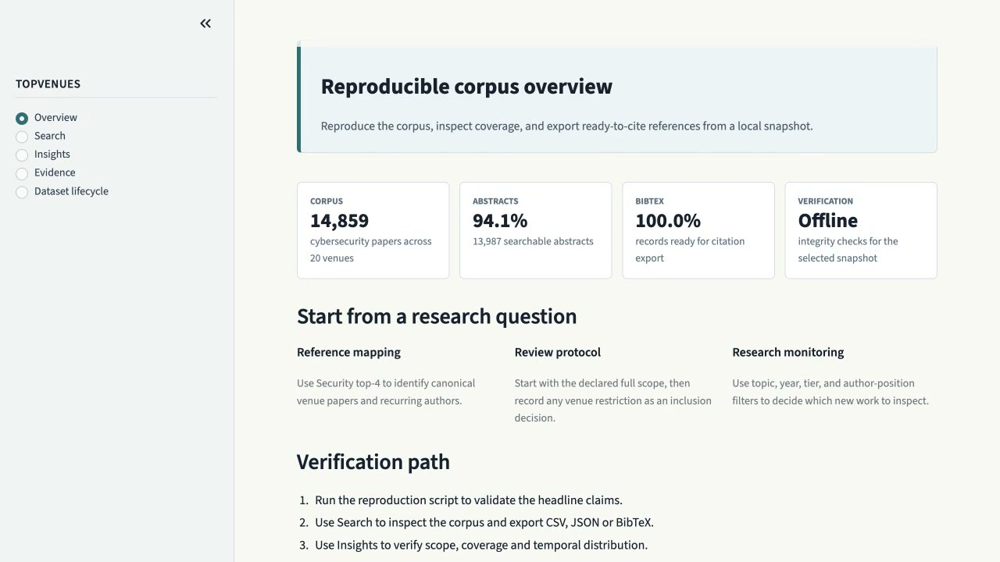

# Seven-minute demonstration

The final SBSeg-SF walkthrough is
[`topvenues-sf-demo-v1.5.0.mp4`](../assets/demos/topvenues-sf-demo-v1.5.0.mp4).
It is exactly 7:00 at 1280×720 and 25 fps, with H.264 video and AAC
US-English narration. The MP4 contains two subtitle streams; Brazilian
Portuguese is the default and English is optional.

Sidecar captions are available as WebVTT and SRT under
`docs/assets/demos/captions/`. The browser-ready `index.html` also marks the
Brazilian Portuguese WebVTT track as default. Production timing and claims are
defined in `cues.json`; `SHOT_PLAN.md` is the reviewer-facing shot map.

